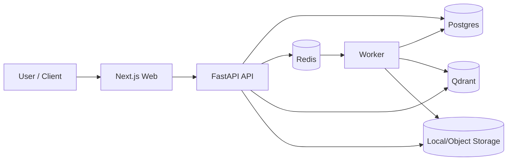
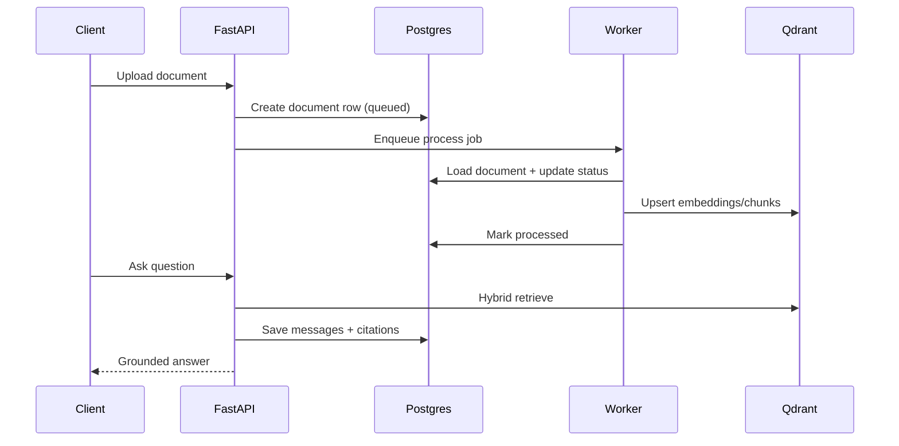

<div align="center">


<p>
  
</p>

<p>
  
  
  
  
  
  
</p>

</div>

## Overview
KnowStack is a multi-tenant RAG platform scaffold for document-grounded chat.
It provides file ingestion, extraction, chunking, retrieval, answer generation, citations, chat history, usage metrics, and async job orchestration.

## What You Get
- Multi-tenant auth model with role guards (`user`, `admin`)
- Upload + dedupe + metadata persistence
- Sync and async processing pipelines (`/process`, `/process-async`)
- TXT/PDF/DOCX parsing and chunking
- Hybrid retrieval (keyword + vector)
- LLM grounded generation with fallback strategy
- Citation persistence (`message_source`)
- Chat history list/detail/export/delete
- Usage logging + admin metrics
- Worker job polling + retry/backoff
- Structured error and request-id flow

## System Architecture


## Request Lifecycle


## Project Structure
```text
KnowStack/
+- api/        # FastAPI backend + services + tests
+- worker/     # Async job worker
+- web/        # Next.js frontend
+- infra/sql/  # SQL bootstrap and runtime migrations
+- docs/       # Planning and implementation notes
+- docker-compose.yml
```

## Quick Start
### 1. Configure environment
```powershell
copy .env.example .env
```

### 2. Start all services
```powershell
docker compose up --build
```

### 3. Open API docs
- Swagger: `http://localhost:8000/docs`

## Core Endpoints
### Health
- `GET /v1/health`

### Documents
- `POST /v1/documents/upload`
- `GET /v1/documents`
- `POST /v1/documents/{document_id}/process`
- `POST /v1/documents/{document_id}/process-async`

### Jobs
- `GET /v1/jobs/{job_id}`
- `POST /v1/jobs/{job_id}/run`

### Chat
- `POST /v1/chat/ask`
- `GET /v1/chats`
- `GET /v1/chats/{chat_id}`
- `DELETE /v1/chats/{chat_id}`
- `GET /v1/chats/{chat_id}/export`

### Admin
- `GET /v1/admin/metrics`

## Database Migrations
- `infra/sql/001_init.sql`
- `infra/sql/002_jobs_and_runtime.sql`

## Current Status
- Backend scaffold is feature-complete for end-to-end local RAG flow.
- Worker + async job flow is implemented.
- Basic API tests and CI are included.

## Next Improvements
- Add deeper retrieval evaluation harness
- Add streaming responses in chat endpoint
- Add full observability dashboards (latency/error/queue)
- Add stronger tenancy isolation tests
- Add production object storage integration

## Contributing
1. Create a feature branch.
2. Keep changes scoped and test-backed.
3. Open a PR with problem statement, approach, and verification notes.

## License
Private project unless explicitly licensed by repository owner.
