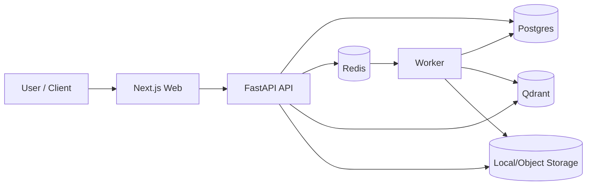
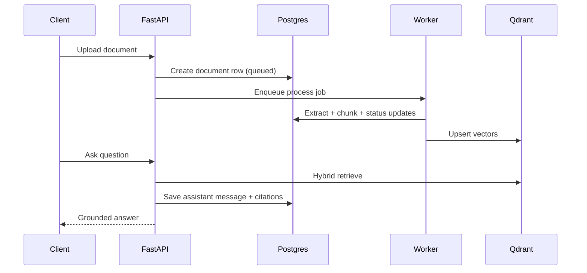

<div align="center">


<p>
  
</p>

<p>
  
  
  
  
  
  
  
</p>

</div>

## Overview
KnowStack is a multi-tenant RAG platform scaffold for document-grounded chat.
It includes upload + dedupe, extraction + chunking, hybrid retrieval, grounded generation, citation persistence, async job orchestration, and admin visibility.

## Table of Contents
- [Overview](#overview)
- [Feature Set](#feature-set)
- [Architecture](#architecture)
- [Project Structure](#project-structure)
- [Quick Start](#quick-start)
- [Configuration](#configuration)
- [API Quick Examples](#api-quick-examples)
- [Core Endpoints](#core-endpoints)
- [Quality and CI](#quality-and-ci)
- [Roadmap](#roadmap)
- [Contributing](#contributing)
- [Security](#security)
- [License](#license)

## Feature Set
- Multi-tenant auth model with role guards (`user`, `admin`)
- Upload + dedupe + metadata persistence
- Sync and async document processing (`/process`, `/process-async`)
- TXT/PDF/DOCX parsing and chunking pipeline
- Hybrid retrieval (keyword + vector)
- Grounded answer generation with fallback path
- Citation persistence (`message_source`)
- Chat history list/detail/export/delete
- Usage logging and admin metrics
- Worker polling loop with retries/backoff
- Structured request-id and uniform error handling

## Architecture




## Project Structure
```text
KnowStack/
|- api/        # FastAPI backend + services + tests
|- worker/     # Async processing worker
|- web/        # Next.js frontend
|- infra/sql/  # SQL bootstrap and runtime migrations
|- docs/       # Architecture and roadmap docs
|- docker-compose.yml
`- Makefile
```

## Quick Start
### 1. Configure environment
```powershell
copy .env.example .env
```

### 2. Start all services
```powershell
docker compose up --build
```

### 3. Open docs and UI
- API Swagger: `http://localhost:8000/docs`
- Web app (when running): `http://localhost:3000`

## Configuration
| Variable | Purpose | Example |
|---|---|---|
| `DATABASE_URL` | Postgres connection for API/worker | `postgresql+psycopg://...` |
| `REDIS_URL` | Queue/cache backend | `redis://redis:6379/0` |
| `QDRANT_URL` | Vector DB endpoint | `http://qdrant:6333` |
| `OPENAI_API_KEY` | Optional LLM provider key | `sk-...` |
| `GEMINI_API_KEY` | Optional LLM provider key | `...` |
| `MAX_UPLOAD_MB` | Upload file size limit | `25` |

## API Quick Examples
### Upload a document
```bash
curl -X POST "http://localhost:8000/v1/documents/upload" \
  -H "Authorization: Bearer <token>" \
  -F "file=@./sample.pdf"
```

### Process asynchronously
```bash
curl -X POST "http://localhost:8000/v1/documents/<document_id>/process-async" \
  -H "Authorization: Bearer <token>"
```

### Ask a grounded question
```bash
curl -X POST "http://localhost:8000/v1/chat/ask" \
  -H "Authorization: Bearer <token>" \
  -H "Content-Type: application/json" \
  -d '{"question":"Summarize key topics from my document"}'
```

## Core Endpoints
### Health
- `GET /v1/health`

### Documents
- `POST /v1/documents/upload`
- `GET /v1/documents`
- `POST /v1/documents/{document_id}/process`
- `POST /v1/documents/{document_id}/process-async`

### Jobs
- `GET /v1/jobs/{job_id}`
- `POST /v1/jobs/{job_id}/run`

### Chat
- `POST /v1/chat/ask`
- `GET /v1/chats`
- `GET /v1/chats/{chat_id}`
- `DELETE /v1/chats/{chat_id}`
- `GET /v1/chats/{chat_id}/export`

### Admin
- `GET /v1/admin/metrics`

## Quality and CI
- API tests: `api/tests/*`
- CI workflow: `.github/workflows/api-ci.yml`

Run tests locally:
```powershell
cd api
pytest -q
```

## Roadmap
- Add streaming response mode for `/v1/chat/ask`
- Add retrieval quality benchmarks and eval harness
- Expand tenant isolation and integration test coverage
- Add cloud storage and production secret-management profile
- Add full observability dashboards (latency/errors/queue depth)

## Contributing
See [CONTRIBUTING.md](CONTRIBUTING.md) for branch, PR, and review standards.

## Security
See [SECURITY.md](SECURITY.md) for vulnerability reporting.

## License
Private project unless explicitly licensed by repository owner.
